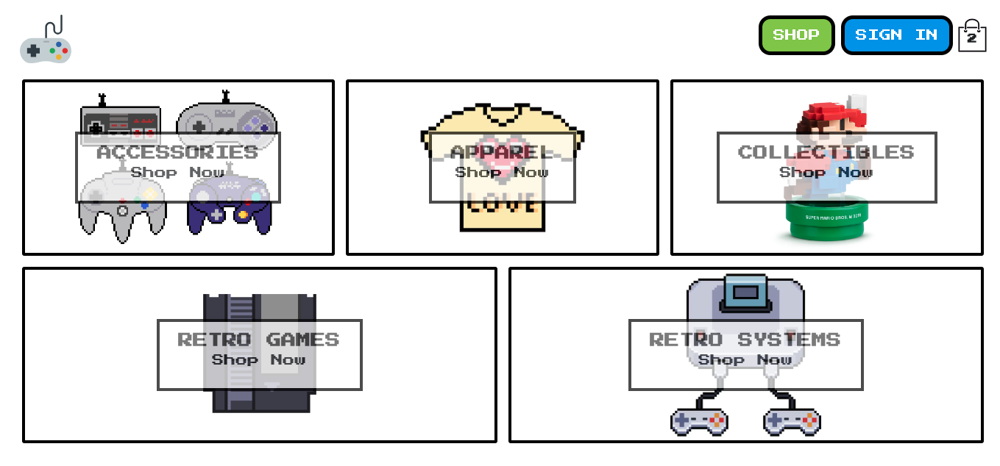

<h1 align="center">🎮 👾🤖Retro Rush 🤖👾🕹️ </h1>

    
    
    
    
    

    
    
    
    
    
    
    
    

## Description
Retro Rush is a personal ReactJS project that mimicks a modern E-commerce website with throwback 8-bit graphics.  

This repository is migrated from a prior repository due to conflicting dependencies leading to failed deployment, see the previous version here: (https://github.com/lingeorge88/E_commerceReact)

# Getting Started 🛫🚀
Vist the deployed application [here:](https://retro-rush-38883.netlify.app/) and start shopping or register an account!

# Usage 🐱‍💻 
When the user visits the website, he/she will be able to browse products and add them to their cart directly, or create an account or login from the upper right-hand side of the screen.

The user does not need to login or create an account to shop or checkout. To add an item to a user's cart simply click the 'Add to Cart' button on each product card.

After the user has finished adding products to their cart, they can click the 'Go To Checkout' button to go to the checkout page where they will be prompted for their billing information

* Note: The application is currently only set up for development and not ready for production, use (4242-4242-4242-4242) for credit card on checkout in order for stripe to function correctly.

# Dependencies 🪵 🧱 

## Front-End
- ReactJS
- Typescript
- React-redux
- NES.CSS
- React Styled Components

## Back-End
- Google Firebase
- Google Firestore

## Deployment
- Netlify

# Testing 🧪 
Unit tests set up for various components(buttons, cart-icon, cart-dropdown)
Small integration tests set up for reducers and actions.
# Contributing ⚒️

:octocat: [George Lin](https://github.com/lingeorge88)

If you would like to contribute to Retro Rush, you can simply fork the repository and create a pull request with your changes. All contributions are welcomed, including bug fixes, feature enhancements, and documentation improvements.

# Questions 📬
 

✉️ Contact me with any further questions:  [GitHub](https://github.com/lingeorge88)